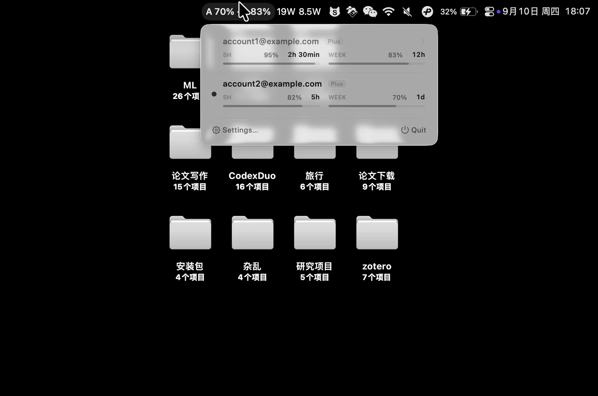

# Codex Duo

<p align="center">
  <strong>Every Codex account, visible from the menu bar.</strong><br>
  Check remaining usage, see reset times, and switch accounts when you need to.
</p>

<p align="center">
  <a href="README.md">简体中文</a> · <a href="README.en.md">English</a> · <a href="https://github.com/ZhuSipu/codex-duo/releases/latest">Download latest</a>
</p>

<p align="center">
  
</p>

Codex Duo is a compact native desktop utility. It brings remaining usage and reset countdowns for multiple Codex accounts into the macOS menu bar or Windows system tray, with account management and switching handled through [`codex-auth`](https://github.com/Loongphy/codex-auth).

## Why use Codex Duo

- **See every account at once.** One panel shows up to ten accounts and their reported usage windows.
- **Know when limits reset.** Remaining percentages, reset countdowns, and data age are always visible.
- **Switch with confidence.** Choose an account and Codex Duo verifies the switch before reopening the Codex App.
- **Keep useful data during failures.** The newest verified snapshot remains visible and is clearly marked when stale.
- **Manage accounts in one place.** Add, rename, remove, and refresh accounts, manually or on a schedule.
- **Respect clear privacy boundaries.** No authentication snapshots are read, no tokens are stored, and no analytics or telemetry are included.
- **Feel at home on your system.** System, light, and dark appearance, nine language choices, and optional launch at login are supported.

## Product surfaces

<p align="center">
  
  
</p>

macOS uses a native AppKit menu-bar interface, while Windows uses a native .NET 8 WPF system-tray interface. Both versions share the same account, usage, and switching rules while following their platform's conventions.

## Download and requirements

Download the installer and SHA-256 checksum for your system from the latest [GitHub Release](https://github.com/ZhuSipu/codex-duo/releases/latest).

### macOS

- macOS 14 or later
- Apple Silicon for current release builds
- The official Codex App
- Node.js/npm and `codex-auth`

Download `macOS-arm64.dmg`, open it, and drag **Codex Duo** into **Applications**. A current personal build may not be notarized. Verify the download source, then Control-click the app and choose **Open** for first launch. Do not disable Gatekeeper globally.

### Windows

- Windows 10 version 2004 or later, or Windows 11
- x64 processor
- The official Codex App
- Node.js/npm and `codex-auth`
- The installer requires the [.NET 8 Desktop Runtime (x64)](https://aka.ms/dotnet/8.0/windowsdesktop-runtime-win-x64.exe)

Run `Codex-Duo-<version>-Windows-x64-Setup.exe` for a per-user installation that needs no administrator privileges. To avoid installing .NET separately, download the self-contained portable ZIP, which includes the runtime. Unsigned builds may trigger SmartScreen; verify the checksum and download source before continuing.

### Install the account helper

Codex Duo detects whether `codex-auth` is available but never installs dependencies silently:

```shell
npm install -g @loongphy/codex-auth@next
codex-auth --help
```

## Get started

1. Launch Codex Duo.
2. Open Settings and choose **Add**.
3. Complete the official Codex login flow in Terminal.
4. Return to Codex Duo; the account and its usage will appear automatically.
5. Select any non-current account to switch.

Authentication remains owned by Codex and `codex-auth`. Codex Duo never asks for your password or displays access tokens.

## Everyday use

### Check usage

Each account shows any available five-hour, weekly, Free monthly, or other reported usage windows. A window that has reached its reset time returns to 100%. Missing data is unavailable, never presented as zero.

### Switch accounts

After you select a target account, Codex Duo closes the Codex App, performs the switch, verifies the active account, and reopens Codex. Switching interrupts an active response, so stop current work first. Selecting the current account is a no-op.

### Refresh and preferences

Automatic refresh can be Off or run every 1, 2, 5, 10, or 15 minutes. **Refresh Now** remains available when automatic refresh is Off. Preferences also cover appearance, language, launch at login, account management, and platform-appropriate proxy options.

## Troubleshooting

- **The menu or tray shows —:** verify that `codex-auth --help` works and at least one account is configured.
- **Usage is marked stale:** check the age label, enable automatic refresh, or choose **Refresh Now**. A failed refresh keeps the newest verified snapshot.
- **An account will not switch:** stop active work, close Codex manually, and try again.
- **Launch at login does not work:** install the app in the normal system location, launch it once from there, and enable the setting again.
- **Add does not open on macOS:** confirm Terminal is present in `/System/Applications/Utilities`, then reopen Settings.

## Privacy and risk

Codex Duo reads only `~/.codex/accounts/registry.json`. It never edits the registry directly or opens managed `*.auth.json` files. Login, refresh, and account operations are delegated to `codex-auth`.

By default, `codex-auth list` may send account access tokens to OpenAI endpoints to refresh usage. Upstream notes that this relies on non-public behavior, may stop working, and may carry account risk. Review the [`codex-auth` disclaimer](https://github.com/Loongphy/codex-auth#disclaimer) before use.

## Build from source

<details>
<summary>macOS and Windows development commands</summary>

macOS requires macOS 14+ and Swift 5.10 command-line tools:

```shell
./Scripts/test.sh
app_path=$(./Scripts/build_app.sh)
open "$app_path"
```

Windows requires the .NET 8 SDK and must be built and verified on a Windows host:

```powershell
dotnet test Windows/CodexDuo.Windows.sln -c Release
./Scripts/package_windows.ps1
```

Before contributing, read [`docs/development-workflow.md`](docs/development-workflow.md), [`docs/feature-spec.md`](docs/feature-spec.md), and [`docs/design-language.md`](docs/design-language.md).

</details>

## License

MIT. See [LICENSE](LICENSE) and [THIRD_PARTY_NOTICES.md](THIRD_PARTY_NOTICES.md).
